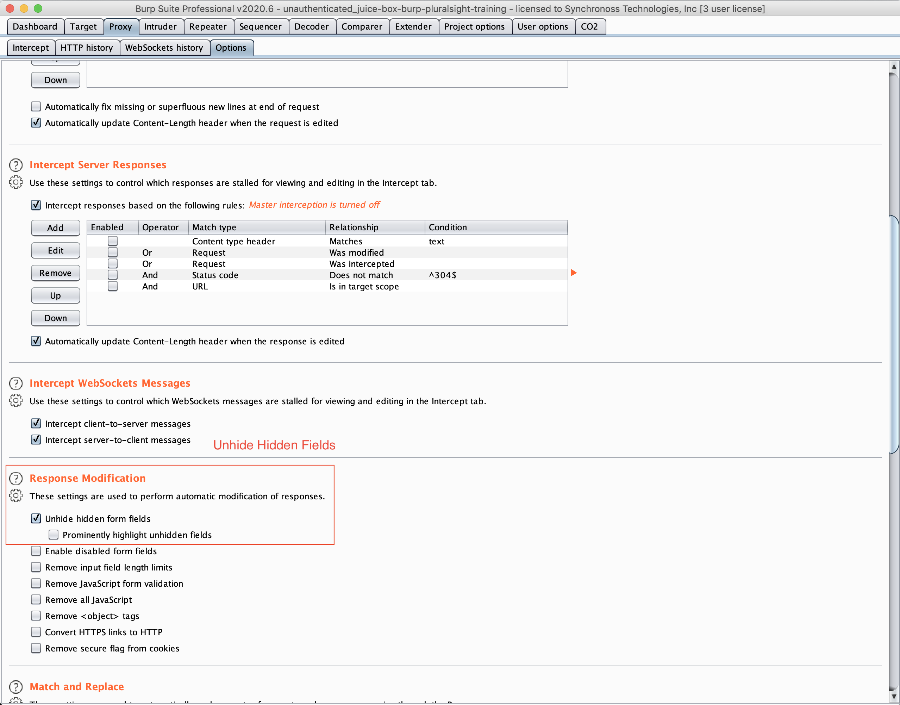
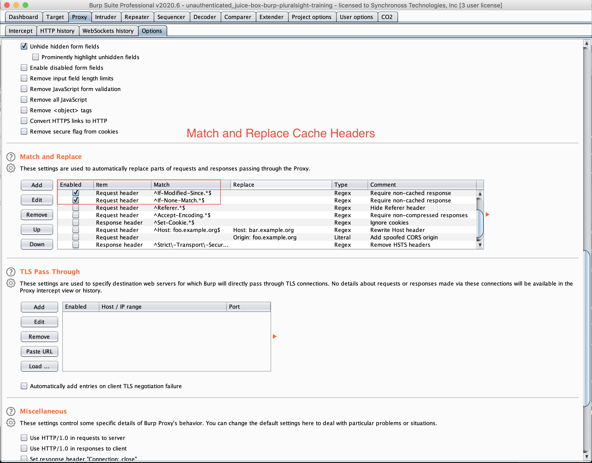
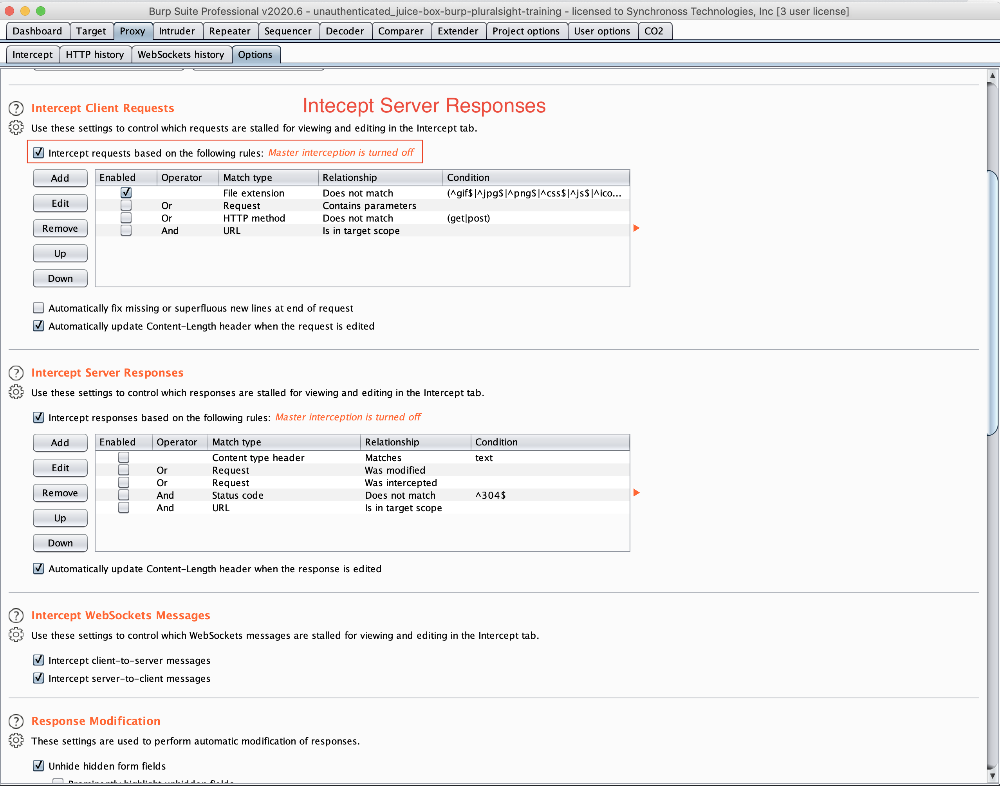
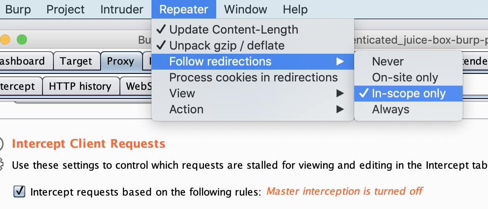
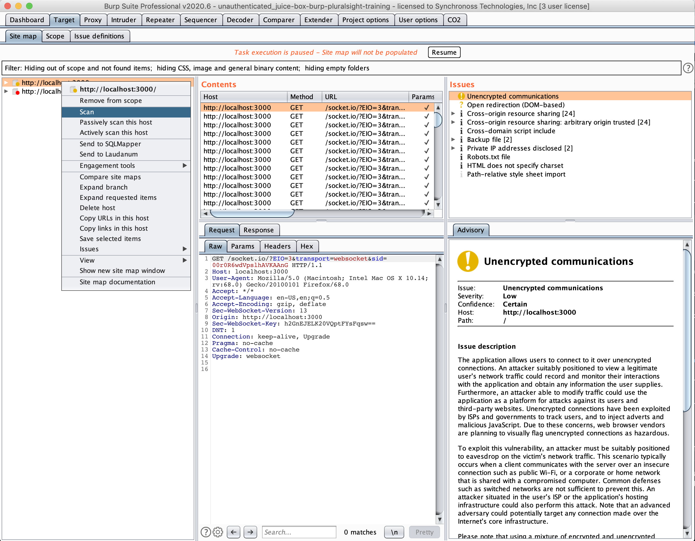
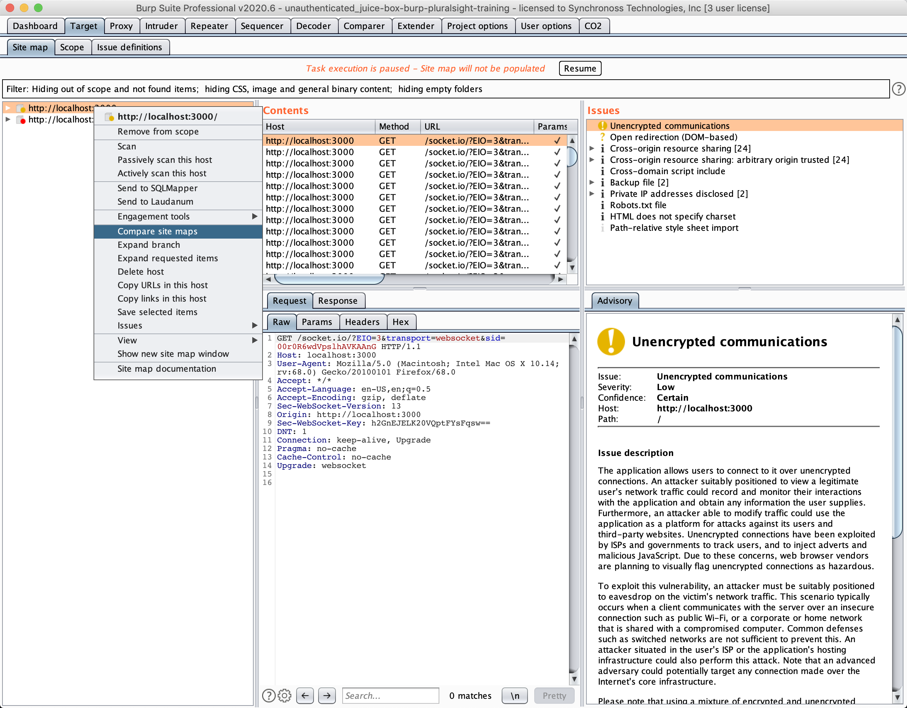
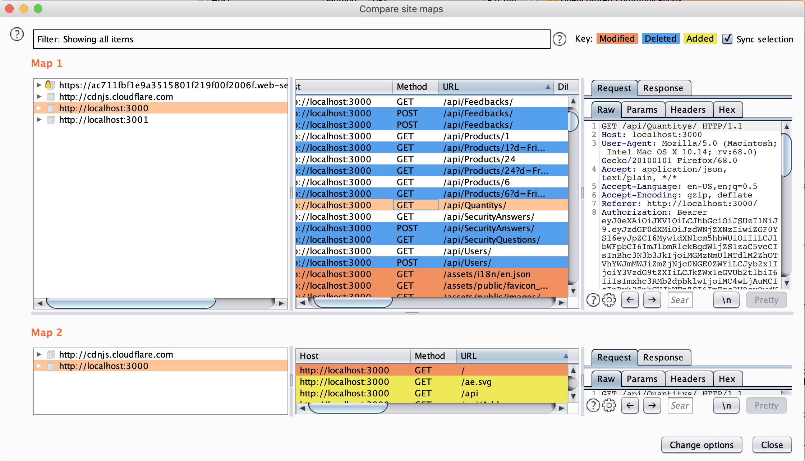
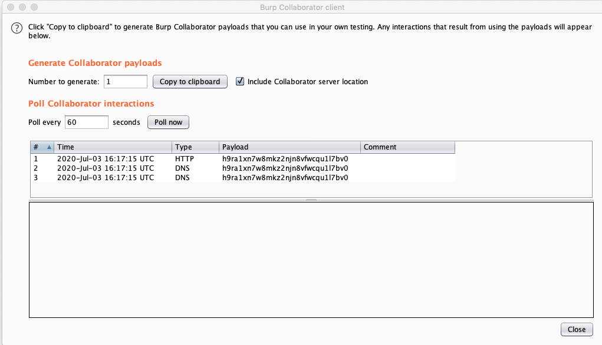

# Burp Notes
These notes are compiled from the pluralsight training "Advanced Web Application Penetration Testing with Burp Suite". Most of the tests were performed against OWASP Juice-Shop version 2.19.2 which is much older than the latest.
# Configurations
## Proxy
* Always unhide hidden form field
    * Proxy -> Options -> Response Modification -> Unhide hidden form fields



* Prevent 304's (data cached in browser)
    * Proxy -> Options -> Match and Replace
        * Request Header: If-Modified-Since
        * Request Header: If-None-Match


* Capture Server Responses
    * Proxy -> Options -> Intercept Server Responses
        * Check `Intercept responses based on the following rules`
        * Uncheck `Content type header`



## Repeater
Set repeater to follow redirects


# Spidering
With Burp 2, Spidering has been replaced by scanning which results in the site tree in the `target` tab being populated.
* Types
    * Automated
        * Good for traditional sites
    * Manual
        * Good for dynamic frontends where most of the logic is client side such as an SPA
    * Hybrid
## Authenticated Scans
* Create fake user account if registration is possible
* Click around the site to populate the site tree via the proxy
* Right click on the root of the site and select scan



## Diffing Two Site Maps
Diff two site maps to see if under certain accounts expose different end points which can be used for privilege escalation via force browsing potential.
* First spider is complete, save the Burp project file
* Second spider is complete
    * Target -> Site Map -> Right Click on Host -> Compare Site Maps



# Audit Scans
These scans will attempt to insert dangerous payloads and observe effects on the site.
* Methods
    * Active
        * Burp will try and inject payloads into requests to the site
    * Passive
        * Burp will obeserve traffic that passes through and speculate
    * Javascript Active
        * DOM based vulns based on returned javascript from requests
# User Enumeration
If the login form returns something to identify the username is what is incorrect
* Capture failed login in burp
* Send to Intruder
* Modify positions to point to username
    * Leave attack type as `sniper`
* Set the payload to a wordlist for usernames

# SQL Injection
Using the same approach as the [User Enumeration](#User Enumeration) section only an injection payload will be used.
* SQL Injection Code for a known username (Bender)
```
; or 1=1 and email like ("%Bender%");--
```
* Capture failed login in burp
* Send to Intruder
* Modify positions to point to field
    * Leave attack type as `sniper`
* Set the payload to a an injection payload from fuzzdb for the field
    * `/fuzzdb/attack/sql-injection/detect/xplatform.txt`
## Burp Extensions
### CO2 (SQLMap Generator)
This plugin from the B App store will allow a right click on a request to be sent to the extension which can build the SQLMap command for the specific request. (This is on top of the ability to export the burp request and import to SQLMap with `sqlmap -r request.txt`)
# HTTP Verb Manipulation
During testing, any get that returns JSON, a PUT and UPDATE should be tested with a new JSON payload at the object endpoint. Many ORMs will add these by default.
# Clickjacking
Burp as a built in tool used to test for clickjacking by running the site through and IFrame and attempting to inject IFrames into the DOM.
* Burl -> Clickbandit -> Copy Javascript
* Open browser javascript console and run the copied javascript
* Press start in the clickbandit UI (Top of the screen)
* Click through UI of the web site
* Select Finish at the top of the page and burp will present all the elements which can be loaded in an IFrame and clickjacked.
# SSRF
Look for any references to resources or IP addresses in return datasets which may be manipulated to create an SSRF condition. Burp as a tester for this.
## Collaborator
* Burp -> Collaborator Client
    * **Do not close this window**
* Copy collaborator payload to clipboard
    * Payload is a dynamic URL that was started by Burp portswigger backend which can be used to test for SSRF
* Repeat the request manually with `intercept` enabled
* Replace the target internal address with the Collaborator address on the clipboard.
    * Will have to prepend with HTTP
* After the request is issued, check the Collaborator window
    * DNS request to resolve the URL
    * HTTP request to the server
    * The above would indicate SSRF vulnerability
    
# Null Byte Injection
Null byte often stops processing of data inside browsers and servers but will pass basic/weak file extension validation checks
* ascii
    * %00
    * 0x00
* Unicode
    * %2500
* Intercept request (or send past request to repeater)
* Inject null byte into bad file extension and append good extension
    * Was http://localhost:3001/ftp/coupons_2013.md.bak
    * To http://localhost:3001/ftp/coupons_2013.md.bak%2500.pdf

# Headless
Burp can be run headless where if is essentially a passive proxy which can log observed issues. Add carbonator for a good report at the end. Requires `brew install jython`. At termination, carbonator will write an HTML report in the directory burp was invoked from.

```bash
# on mac only - burp suite install location
cd "/Applications/Burp Suite Professional.app/Contents/java/app"

# Format
java -jar -Xmx2G -Djava.awt.headless=true /path/too/burpsuite_pro.jar <protocol> <host> <port> <folder>

# Example
java -jar -Xmx2G -Djava.awt.headless=true /path/too/burpsuite_pro.jar http localhost 3000 /
```