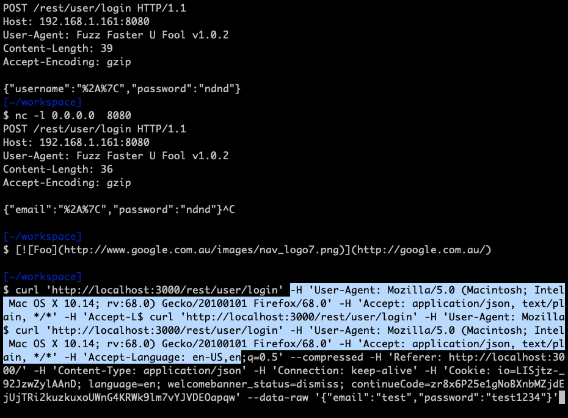

# Fuzzing
How to fuzz stuff with various command line tools. These were tested against OWASP juice-shop
## burp intruder
1. Send the request (login for example) to the intruder
2. Specify the positions
    * Do one at a time when.
3. Set the paylod
    * Looking for injections
        *  fuzzdb (fuzzdb/attack/sql-injection/detect/xplatform.txt)
3. Unset payload encoding if JSON, leave if URL parameters
    * Only need this for URL parameters
    * For JSON payloads, need to be unset
4. Set `Grep-Match` to match failed condition to have it flagged in the result set (for filtering)
5. Set redirectings to `In-scope only` and `Process cookies in redirections`.
## ffuf
Command line fuzzer which can be used on the OSCP
1. Capture the headers from the POST in question (browser, burp, wireshark, etc) and copy the command as a CuRL request. This is to get the headers to add to ffuf. They can be copied as is (e.g. all the -H's and passed directly to ffuf). **Do not interact with the website after this capture**.
2. Construct the POST command replacing the field to fuzz with **FUZZ**.
3. Fuzz and profit
Get the curl command from the browser

Copy the headers

```bash
# curl command copied from the browser
